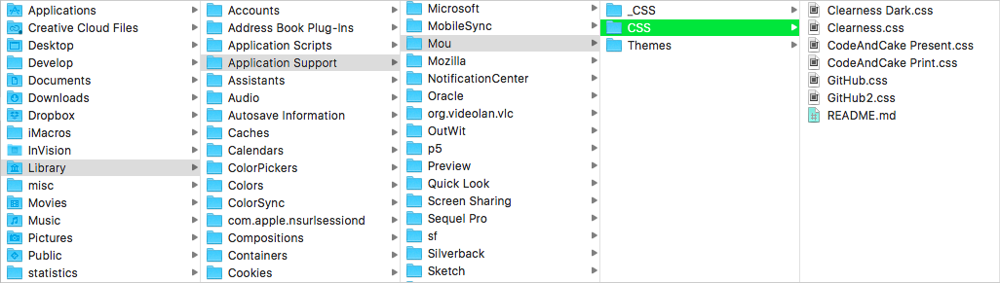
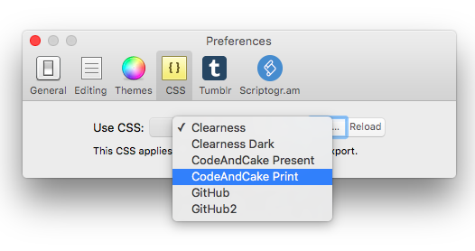

### Getting started

1. Download and install [Mou](http://25.io/mou).
* With Finder, go to `YOUR_NAME/Library/Application Support/Mou`, where `YOUR_NAME` stands for your Mac *home* folder
* Clone this repository inside the `Mou` folder.
* In the `Mou` folder, rename the `CSS` folder as `_CSS` (or whatever you like). 
	> This step is to make a backup of that folder, which contains the default Mou stylesheets.
* Rename the repository folder as `CSS`. 

	> The `CSS` folder is where Mou grabs its stylesheets. By renaming the repository folder as `CSS` you've effectively added some new stylesheets.
	
	
	
### Changing stylesheets in Mou	

1. Open Mou.
* Open the Mou `Preferences`, either with <kbd>cmd</kbd> + <kbd>,</kbd> or `Mou` > `Preferences...`
* Click on the `CSS` tab
* Change the selected stylesheet from the dropdown. If the stylesheet you're after doesn't appear, you may have to click `Reload`

	